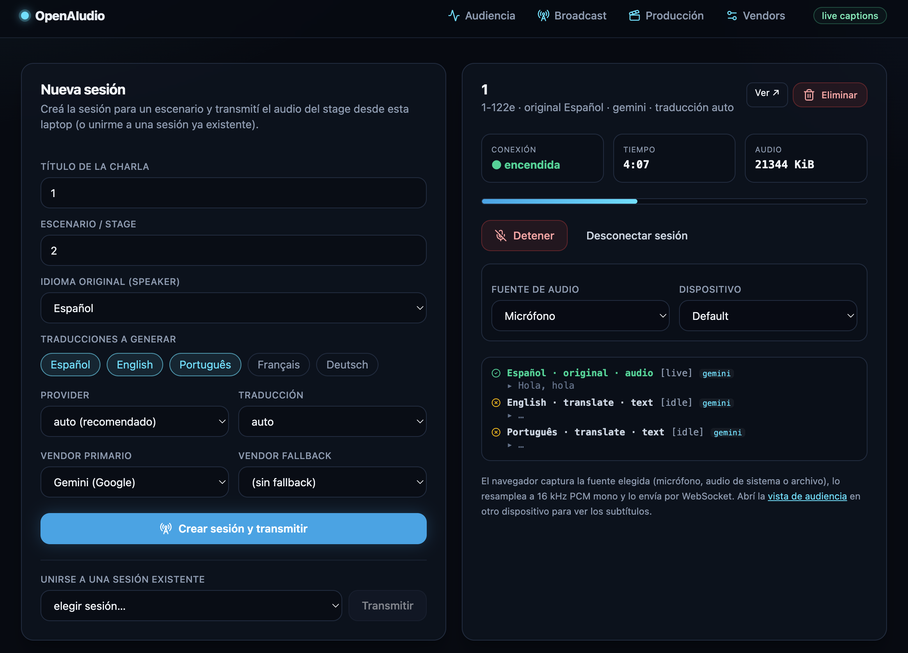
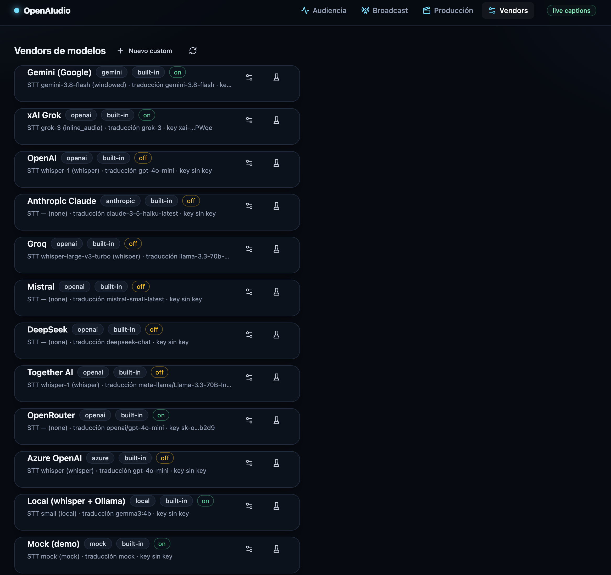
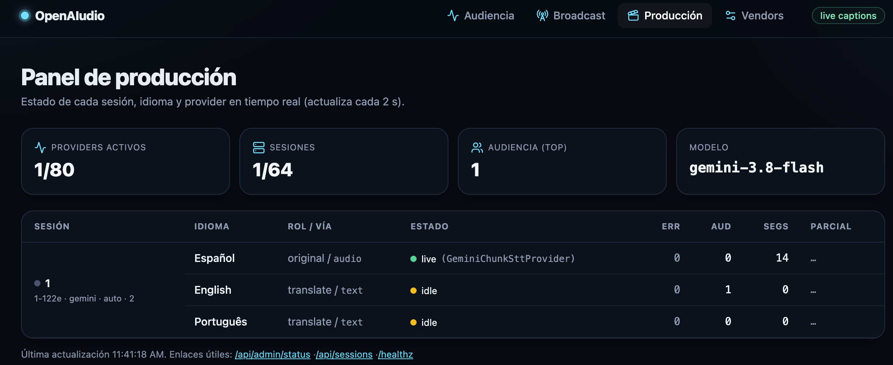
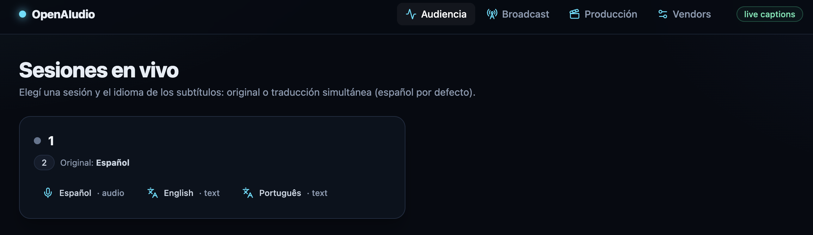
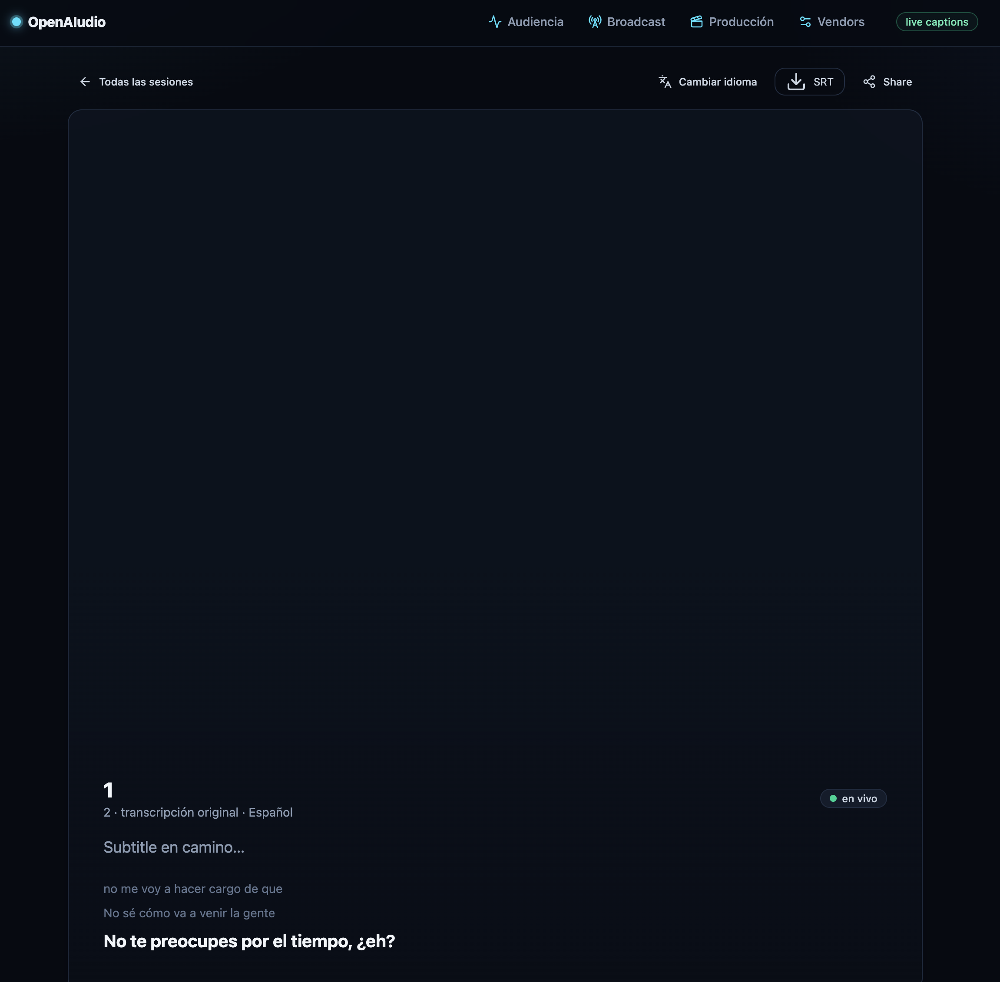
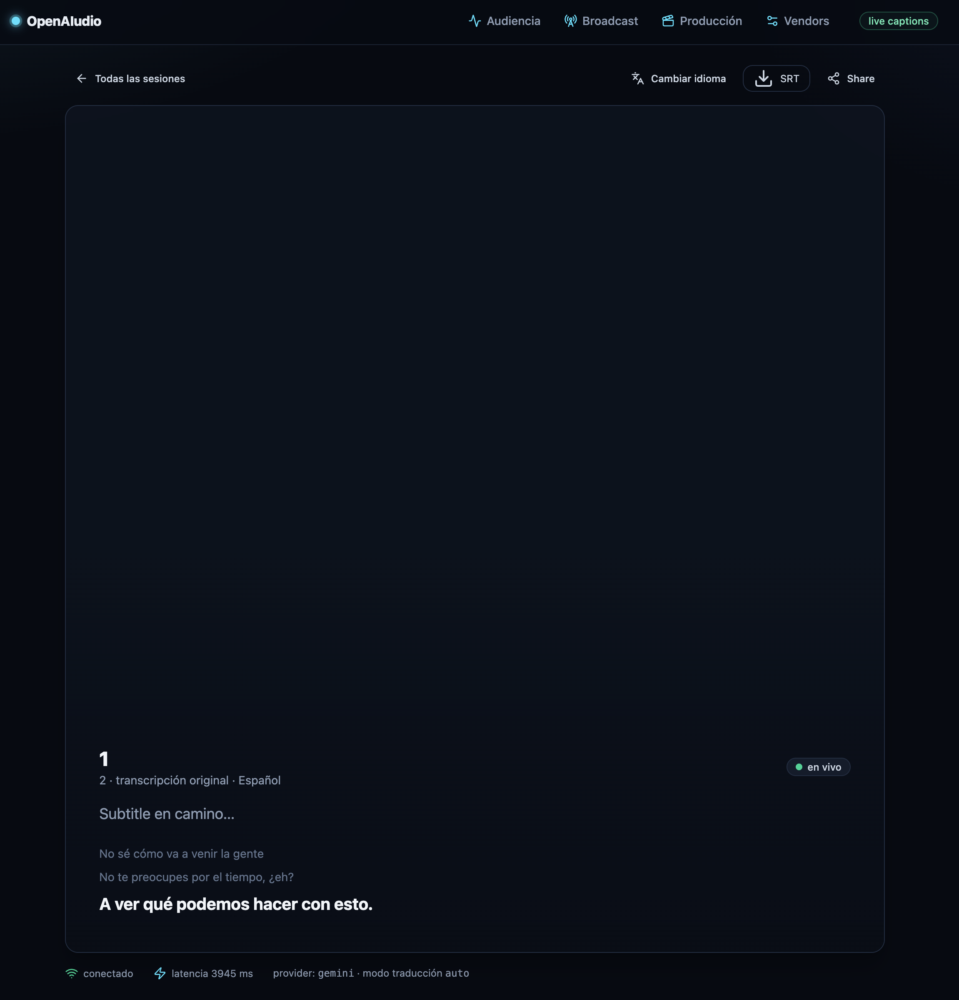

# Screenshots & demo video

Quick look at OpenAIudio in action.

## Demo video

Demo screen recording of the app:

<https://www.youtube.com/watch?v=_wItGKUtfIU>

## Screenshots

Captured during a live caption session (web UI). Each file lives in
`docs/screenshots/`:

| # | Screenshot | File |
| --- | --- | --- |
| 1 | Web UI — screenshot 1/6 |  |
| 2 | Web UI — screenshot 2/6 |  |
| 3 | Web UI — screenshot 3/6 |  |
| 4 | Web UI — screenshot 4/6 |  |
| 5 | Web UI — screenshot 5/6 |  |
| 6 | Web UI — screenshot 6/6 |  |

> The captions above are generic; to add precise per-screenshot descriptions,
> edit this file after reviewing the images.